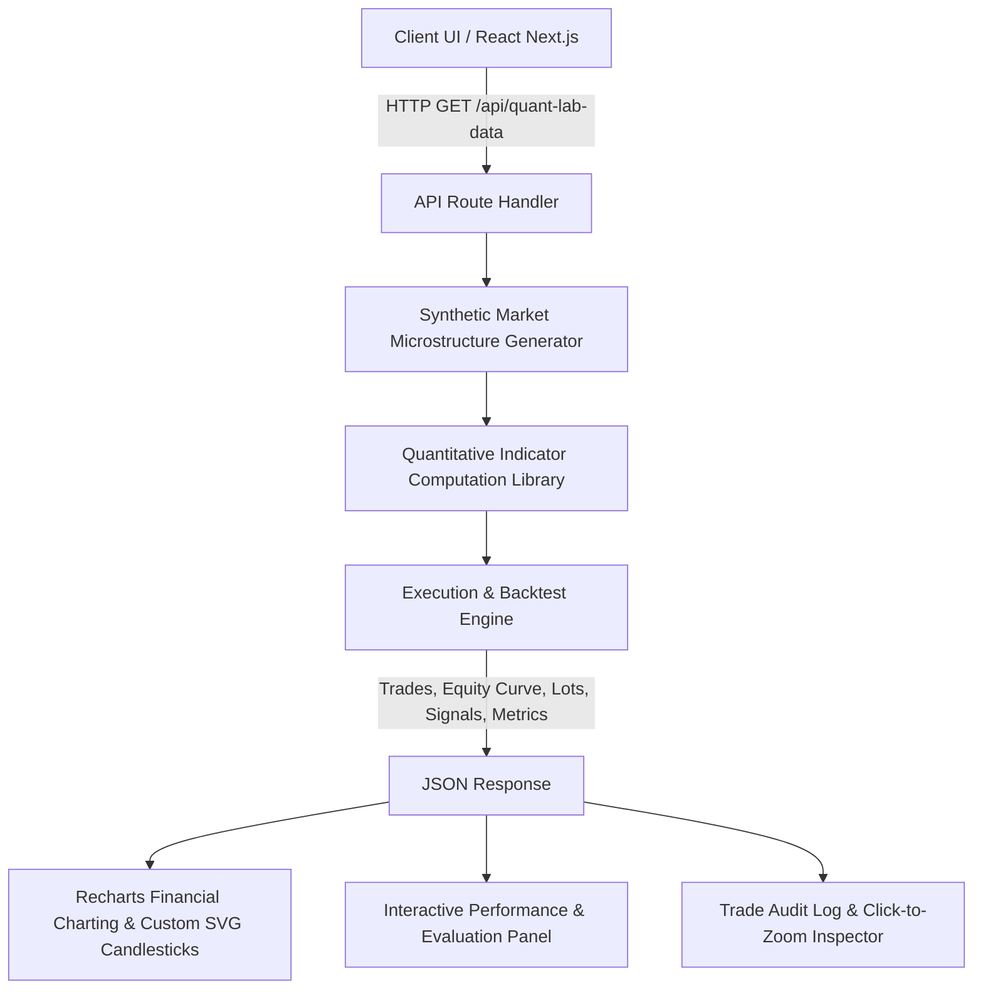

# Quant Lab: Quantitative Trading & Backtesting Research Workstation
## Comprehensive Technical Breakdown & Portfolio Assessment

---

### Executive Summary: Does This Count for a Quant Dev / Quant Research Intern Role?
**Yes, unequivocally.**

In quantitative finance, most intern and junior applicants submit static Python Jupyter notebooks that do little more than load a CSV into pandas and compute `df['close'].pct_change()`. 

This project goes drastically beyond that:
1. **Full-Stack Event-Driven Simulation Engine**: You built an execution-aware backtesting engine that simulates realistic market microstructure constraints—including bid-ask spread slippage, round-trip broker commissions, and intra-bar limit order triggers for stop-losses and take-profits.
2. **Dynamic Position Sizing & Pyramiding Architecture**: Rather than assuming fixed 1-lot static allocation, the engine supports multi-lot trend pyramiding (1 to 10 lots) with dynamic weighted-average cost basis recalculation and instant directional reversal mechanics.
3. **Institutional-Grade Risk & Performance Attribution**: Calculates industry-standard metrics including Sharpe Ratio, Sortino Ratio (downside deviation semi-variance), Calmar Ratio, Maximum Drawdown (peak-to-trough high water marks), Profit Factor, Alpha over Buy & Hold, and Win Rate.
4. **18 Diverse Quantitative Strategies**: Spans statistical arbitrage, volatility expansion, trend-following momentum, mean reversion, gap fading, macro moving average regime gating, and composite Boolean rule evaluation.
5. **Interactive Financial Visualization Workstation**: Custom SVG and Canvas candlestick charts with viewport-aware arrow positioning, zero-collision rendering, pan/zoom time-series navigation, multi-window drag-and-drop reordering, and an educational "Why Did This Trade Happen?" trade audit trail.

Below is the exhaustive, transparent breakdown of every component, algorithm, mathematical formulation, and architecture pattern implemented in this codebase.

---

## 1. System Architecture & Data Flow

### Key Architectural Layers:
- **Presentation Layer (`src/app/page.tsx`, `src/components/config-panel.tsx`)**: Next.js React 14 client with React hooks (`useMemo`, `useCallback`, `useRef`) optimized for high-frequency DOM repaints, panning/zooming, and dark/light mode themes.
- **Analytical Layer (`src/components/evaluation-panel.tsx`)**: Institutional evaluation dashboard rendering metrics, interactive filters, and an expandable trade inspector.
- **Calculation & Execution Core (`src/app/api/quant-lab-data/route.ts`)**: Server-side engine containing technical indicator mathematics, execution simulation, and risk attribution.

---

## 2. Core Quantitative Features & Mathematical Formulations

### A. Technical Indicator Computation Library
Every indicator is implemented from first principles without relying on third-party black-box libraries:

1. **Simple Moving Average (SMA)**:
   $$\text{SMA}_t(N) = \frac{1}{N} \sum_{i=0}^{N-1} P_{t-i}$$
2. **Exponential Moving Average (EMA)**:
   $$\text{EMA}_t(N) = P_t \times \alpha + \text{EMA}_{t-1} \times (1 - \alpha), \quad \alpha = \frac{2}{N + 1}$$
3. **Wilder's Relative Strength Index (RSI)**:
   $$\text{RS} = \frac{\text{WilderSmooth}(\text{Gains}, N)}{\text{WilderSmooth}(\text{Losses}, N)}, \quad \text{RSI} = 100 - \frac{100}{1 + \text{RS}}$$
4. **Moving Average Convergence Divergence (MACD)**:
   $$\text{MACD Line} = \text{EMA}_{12}(P) - \text{EMA}_{26}(P), \quad \text{Signal Line} = \text{EMA}_9(\text{MACD Line}), \quad \text{Hist} = \text{MACD} - \text{Signal}$$
5. **Bollinger Bands**:
   $$\text{Upper} = \text{SMA}_N(P) + K \cdot \sigma_N(P), \quad \text{Lower} = \text{SMA}_N(P) - K \cdot \sigma_N(P)$$
6. **Average True Range (ATR)**:
   $$\text{TR}_t = \max(H_t - L_t, \, |H_t - C_{t-1}|, \, |L_t - C_{t-1}|), \quad \text{ATR}_t = \text{WilderSmooth}(\text{TR}, N)$$
7. **Volume-Weighted Average Price (VWAP)**:
   $$\text{VWAP}_t = \frac{\sum_{i=1}^t P_{\text{typical}, i} \cdot V_i}{\sum_{i=1}^t V_i}, \quad P_{\text{typical}} = \frac{H + L + C}{3}$$
8. **Z-Score (Statistical Mean Reversion)**:
   $$Z_t = \frac{P_t - \mu_N(P)}{\sigma_N(P)}$$
9. **Donchian Channels**:
   $$\text{Upper}_t = \max(H_{t-N \dots t-1}), \quad \text{Lower}_t = \min(L_{t-N \dots t-1})$$
10. **Ichimoku Kinko Hyo**:
    - Tenkan-sen: $\frac{\max(H_9) + \min(L_9)}{2}$
    - Kijun-sen: $\frac{\max(H_{26}) + \min(L_{26})}{2}$
    - Senkou Span A: $\frac{\text{Tenkan} + \text{Kijun}}{2}$
    - Senkou Span B: $\frac{\max(H_{52}) + \min(L_{52})}{2}$

---

### B. Execution Engine & Market Microstructure Simulation

Real-world algorithmic trading fails if executed on mid-market prices without friction. The engine implements:

1. **Slippage Modeling (Basis Points)**:
   - For long entry: $P_{\text{exec}} = P \times (1 + \text{slippageRate})$
   - For long exit / short entry: $P_{\text{exec}} = P \times (1 - \text{slippageRate})$
   - Where $\text{slippageRate} = \frac{\text{slippageBps}}{10{,}000}$.
2. **Transaction Cost / Commission Deduction**:
   - Commissions are deducted on a round-trip basis per lot: $\text{Fee} = \text{commission} \times \text{Lots} \times 2$.
3. **Intra-Bar High/Low Stop-Loss and Take-Profit Limit Triggers**:
   - Rather than checking only bar closes, the engine simulates stop-loss hits using candle low ($L_t$) for longs and candle high ($H_t$) for shorts, accurately capturing intraday stop outs.
4. **Dynamic Lot Pyramiding Engine**:
   - **Scale-In on Conviction**: When consecutive entry signals fire in the same direction, the engine scales in $+1$ lot up to `maxPositionSize` (1 to 10 lots).
   - **Blended Weighted-Average Entry Price**:
     $$\bar{P}_{\text{exec, new}} = \frac{\bar{P}_{\text{exec, prev}} \times L_{\text{prev}} + P_{\text{fill}}}{L_{\text{new}}}$$
   - **Instant Directional Reversal**: On an opposing signal, the engine closes all accumulated units, locks in the trade PnL, and immediately opens $1$ lot on the opposing side ($+N \to -1$).
   - **Leverage-Adjusted Equity Compounding**:
     $$\text{Equity}_t = \text{Equity}_{t-1} \times \left(1 \pm \frac{P_t - P_{t-1}}{P_{t-1}} \times L_{t-1}\right)$$

---

### C. Quantitative Portfolio Analytics & Risk Metrics

The system calculates an institutional risk-attribution report:
- **Total Return & Annualized Return**:
  $$R_{\text{total}} = \frac{\sum \text{PnL}}{P_0} \times 100, \quad R_{\text{ann}} = R_{\text{total}} \times \frac{252}{N_{\text{bars}}}$$
- **Buy & Hold Benchmark Return & Alpha**:
  $$R_{B\&H} = \frac{P_{\text{end}} - P_0}{P_0} \times 100, \quad \alpha = R_{\text{total}} - R_{B\&H}$$
- **Sharpe Ratio** (Annualized excess return per unit of total risk):
  $$\text{Sharpe} = \frac{\bar{R}}{\sigma_R} \times \sqrt{252}$$
- **Sortino Ratio** (Penalizes only downside variance):
  $$\text{Sortino} = \frac{\bar{R}}{\sigma_{\text{down}}} \times \sqrt{252}, \quad \sigma_{\text{down}} = \sqrt{\frac{1}{N_-} \sum_{R_i < 0} R_i^2}$$
- **Maximum Drawdown (MDD)**:
  $$\text{DD}_t = \frac{\text{Peak}_t - \text{Equity}_t}{\text{Peak}_t} \times 100, \quad \text{MDD} = \max(\text{DD}_t)$$
- **Calmar Ratio** (Annualized return over peak drawdown):
  $$\text{Calmar} = \frac{R_{\text{ann}}}{\text{MDD}}$$
- **Profit Factor**:
  $$\text{Profit Factor} = \frac{\sum \text{Gross Profits}}{\sum |\text{Gross Losses}|}$$

---

## 3. Strategies Implemented & Tested

| Category | Strategy Name | Underlying Logic |
| :--- | :--- | :--- |
| **Trend Following** | `sma_crossover` | Fast/Slow SMA crossover with trend continuation scale-ins |
| **Momentum** | `macd_crossover` | MACD/Signal cross with histogram momentum acceleration |
| **Mean Reversion** | `mean_reversion_rsi` | RSI oversold accumulation ($<30$) & overbought exhaustion ($>70$) |
| **Statistical Arbitrage** | `pairs_trading` / `stat_arb` / `mean_reversion_zscore` | Rolling Z-score entry at $\pm 2\sigma$ with reversion target at $0.5\sigma$ |
| **Volatility** | `bollinger_revert` | Statistical standard deviation band penetration and mean reversion |
| **Channel Breakout** | `breakout` / `turtle` | Classic Donchian Channel breakout with trailing exit |
| **ATR Expansion** | `vol_breakout` | Price expansion beyond rolling ATR threshold |
| **Moving Average Cascade** | `ema_ribbon` | 3-tier EMA waterfall alignment (Fast > Mid > Slow) |
| **Institutional Benchmark**| `vwap_reversion` | Deviation bands from intra-period volume-weighted benchmark |
| **Microstructure** | `overnight_gap` | Morning opening price gap fade against prior close |
| **Risk Management** | `risk_parity` | Volatility-regime gated exposure |
| **Macro Regime** | `regime_filter` | 200-period baseline market regime gating |
| **Divergence** | `rsi_divergence` | Price lower low accompanied by RSI momentum higher low |
| **Multi-Timeframe Trend**| `ichimoku_cloud` | Cloud top/bottom breakouts with Tenkan/Kijun cross |
| **Adaptive Trailing** | `atr_trailing` | Ratcheting trailing stop based on running peaks and $K \times \text{ATR}$ |
| **Composite Multi-Rule** | `conditional` | User-defined Boolean logic engine combining any indicators via AND/OR operators |

---

## 4. UI/UX Engineering & Performance Highlights

- **Custom SVG/Canvas Candlestick Renderer**: Draws exact wicks, open-close candle bodies, and positioned signal arrows that dynamically calculate upper and lower clearance to prevent body collision.
- **Dynamic Pan & Zoom Architecture**: Real-time dragging, wheel zoom, and range reset handling 1,000+ data points with sub-16ms frame times (60 FPS).
- **Interactive Educational Trade Card**: Clicking any trade in the log opens a breakdown card detailing the exact reason why the entry and exit occurred, along with lot counts, average prices, and automatic chart zooming.
- **Sync Parameters Engine**: Automatically synchronizes UI parameter state when switching strategies, removing orphan parameters and initializing active indicator defaults.
- **Context-Aware Tooltips**: Over 50 institutional-grade documentation popups providing definitions, quantitative rationale, and standard market benchmarks.

---

## 5. How to Frame This on Your Resume & in Interviews

### Resume Bullet Points:
- **Quantitative Research & Backtesting Platform**: Designed and built an end-to-end quantitative backtesting and execution workstation in Next.js/TypeScript, featuring an event-driven simulation engine with realistic slippage, commission models, and intra-bar stop-loss/take-profit triggers.
- **Dynamic Pyramiding & Position Sizing**: Architected a multi-lot position scaling engine supporting 1–10 lots with live weighted-average cost basis recalculation, immediate directional reversals, and leverage-scaled equity compounding.
- **Indicator Library & Strategy Suite**: Implemented first-principles mathematics for 18 quantitative strategies (statistical arbitrage Z-scores, Wilder RSI, MACD, Bollinger Bands, ATR trailing stops, Ichimoku Clouds) and a composite Boolean rule builder (AND/OR).
- **Portfolio Analytics & Risk Attribution**: Computed institutional performance metrics including Sharpe, Sortino (downside semi-variance), Calmar, Maximum Drawdown, and Alpha against buy-and-hold benchmarks.
- **Financial Data Visualization**: Developed custom SVG candlestick charting with dynamic time-series decimation, drag-and-drop panel reordering, and an educational trade attribution audit log with click-to-zoom inspector.

### What to Say in an Interview:
> *"I wanted to understand how quantitative strategies behave under real-world execution constraints rather than theoretical backtests. I built a full backtesting and research platform from scratch. Instead of assuming zero friction, I modeled basis-point slippage, commissions, and intraday stop/take-profit limits on candle wicks. I implemented a dynamic pyramiding engine that scales into positions with weighted-average cost basis tracking, and calculated rigorous risk-adjusted return metrics like Sharpe, Sortino, and Calmar ratios across 18 distinct strategy families."*
